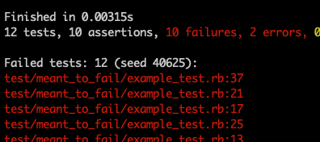

# minitest-rerun-failed
[](https://badge.fury.io/rb/minitest-rerun-failed)

[](https://badge.fury.io/rb/minitest-rerun-failed)

Easy rerun of failed tests with minitest. Prints a list of failed tests and seed at the end of the test run to console and file. Re-run the failed tests with `bin/rerun_failed_tests`.



## Features
- Outputs all failed tests in short summary at end of test run.
  - To console and / or to file
  - Optionally includes line numbers
- Lists seed of run for rerun.
- Executable for running only failed tests
  - Until done, use something like 
    - `ruby $(cat .minitest_failed_tests.txt)`
    - `bundle exec rails test $(cat .minitest_failed_tests.txt)`

## Installation

```
bundle add "minitest-rerun-failed" --group test
```

If you want to install the executable to `bin/rerun_failed_tests`:

```
bundle binstubs minitest-rerun-failed
```

## Usage

Use it like any Minitest::Reporters like such:

```ruby
Minitest::Reporters.use! [
  Minitest::Reporters::ProgressReporter.new, # This is just my preferred reporter. Use the one(s) you like.
  Minitest::Reporters::FailedTestsReporter.new
]
```

Now failed tests and seed will be printed at the end of the test report.

If you have installed the binstub, you can rerun the failed tests with 
```
bin/rerun_failed_tests
```

If you have not installed the binstub, you can rerun the failed tests with something like:
```
# Ruby:
ruby $(cat .minitest_failed_tests.txt)

# Rails:
bundle exec rails test $(cat .minitest_failed_tests.txt)
```

### Options
- include_line_numbers: Include line numbers in outputs. Defaults to true
- verbose: Output to stdout. Defaults to true
- file_output: Output to file. Defaults to true
- output_path: Path to place output files in. Defaults to '.'
  - Note: If you use the output_path option, you need to have `ENV["MINITEST_FAILED_TESTS_REPORT_DIR"]` set to use the executable

## Other
### Why line numbers instead of test names? What if the lines change as I am fixing things?
Line numbers were much easier to implement.
If you find a good way to output test names instead, please open a PR with tests to add it as an option.

As for if line numbers change, the most likely outcome is that the whole file will simply be run instead of a single test.
You can also use the option `include_line_numbers: false` to always output whole files for greater safety.

## Development

After checking out the repo, run `bin/setup` to install dependencies. Then, run `rake test` to run the tests. You can also run `bin/console` for an interactive prompt that will allow you to experiment.

To install this gem onto your local machine, run `bundle exec rake install`. To release a new version, update the version number in `version.rb`, and then run `bundle exec rake release`, which will create a git tag for the version, push git commits and the created tag, and push the `.gem` file to [rubygems.org](https://rubygems.org).

## Contributing

Bug reports and pull requests are welcome on GitHub at https://github.com/houen/minitest_rerun_failed.

## License

The gem is available as open source under the terms of the [MIT License](https://opensource.org/licenses/MIT).

https://stackoverflow.com/questions/19910533/minitest-rerun-only-failed-tests
